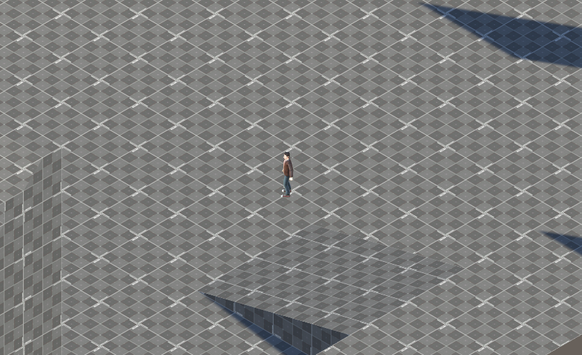
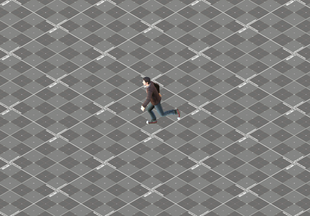
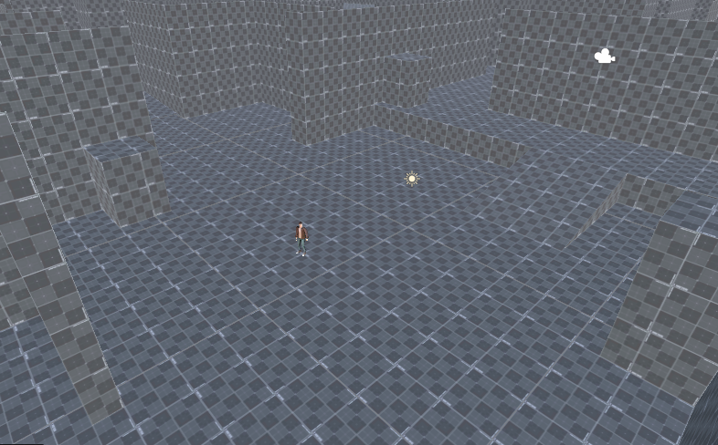

# 3D Isometric Player Controller Prototype

A Unity 3D Project prototype with Isometric camera view and player controller with a simple 3D Character model.
The player moves relative to a fixed isometric camera, turns toward movement,
and faces the cursor while the right mouse button is held.

## Features

- Camera-relative WASD movement and smooth character turning.
- Right-click cursor aiming.
- Shift to run; backward movement while aiming is limited to walking.
- Idle, walk, and run animation blending.
- Isometric camera follow with smooth, bounded mouse-wheel zoom.
- Day & Night cycle with ambience.
- Flashlight view during night cycle.
- Footstep sounds based on distance and walk/run.

## Controls

| Input | Action |
| --- | --- |
| WASD | Move |
| Hold Shift | Run |
| Hold right mouse button | Face the cursor |
| Scroll up / down | Zoom in / out |
| F | Toggle flashlight (Night time only) |

## Screenshot showcase

## Getting started

1. Open the Unity project through Unity Hub using the version recorded in
   `ProjectSettings/ProjectVersion.txt`.
2. Ensure the Input System package is installed and Active Input Handling is
   set to Input System Package (New) or Both.
3. Open the prototype scene, press Play, and click inside the Game view.

## Credits

Character: Casual Male by manoeldarochadeoliveira on CGTrader.
Third-party character assets retain their own license; this README does not
grant redistribution rights.

## Author

Made by LiteDuck1986, this project is free to use, copy and do whatever you want with it.
